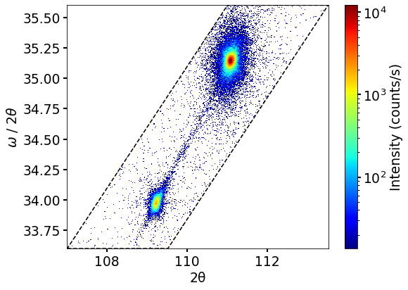
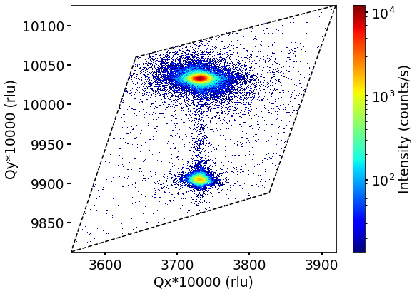
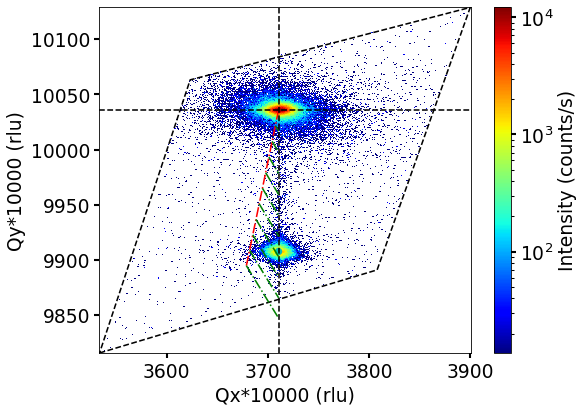
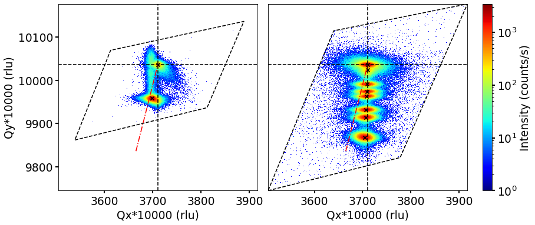
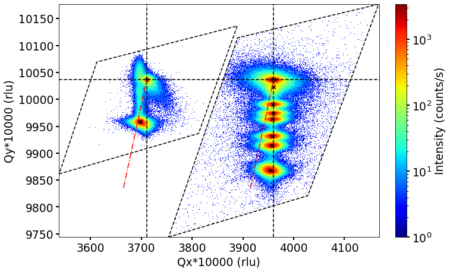

# `xrdpy`: Python package for 2D X-ray diffraction data analysis


<!-- =========================================================== -->

<!-- =========================================================== -->
 |  | 
:-------------------------:|:-------------------------:|:-------------------------:
AlGaN/AlN HEMT real space XRD | AlGaN/AlN HEMT reciprocal space XRD | AlGaN/AlN HEMT reciprocal space (rescaled) XRD

 |  | 
:-------------------------:|:-------------------------:|:-------------------------:
Reciprocal space XRD with peaks | Reciprocal space XRD maps merging | Reciprocal space (rescaled) XRD merging
<!-- =========================================================== -->

<!-- =========================================================== -->
## Developers and contributors
<!-- =========================================================== -->

__Developer of xrdpy :__

* [Badal Mondal](https://github.com/bmondal94)

* [Pietro Pampili](https://github.com/pampili)

__xrdpy Contributors:__  [Contributors](https://github.com/XRDmapAnalysis/xrdpy/graphs/contributors)

* We sincerely thank each and every contributor for their valuable input and support.

__Contact us:__ [Email developer/maintainer team](mailto:badalmondal.chembgc@gmail.com,pietro.pampili@tyndall.ie)

* If you would like to contribute to the development of `xrdpy` or request new functionality, please get in touch with [us](mailto:badalmondal.chembgc@gmail.com,pietro.pampili@tyndall.ie) or open a pull request. We appreciate and respect our users' views and are committed to providing the best experience possible. Your feedback is highly valued. We will be happy to support your request ASAP.

<!-- =========================================================== -->

<!-- =========================================================== -->
## Installation

### 1. Requirements
```
    1. python>=3.12
    3. numpy>=1.13
    5. scipy>=1.26
    7. matplotlib
```

### 2. Installation from github repository

```
    git clone https://github.com/XRDmapAnalysis/xrdpy.git
    cd xrdpy
    pip install .  
```
Or, without cloning
```
    pip install git+https://github.com/XRDmapAnalysis/xrdpy.git #@specific_branch
```

### 3. Installation using `pip` [* not available yet]

```
    pip install xrdpy
```

<!-- =========================================================== -->

<!-- =========================================================== -->
## Usage
__Documentation__: [here](docs/USAGE.md)

The detailed documentation is available [here](docs/USAGE.md). Explore the [tutorial](tests) folder for example tutorials. Below are quick snippets showcasing what you can achieve with `xrdpy`:
```
xrdpy package:
    1. general_fns class
        1.1 alloy_parameters_from_binary()
    1. xrd class
        1.1 xrd_read_data()
        1.2 find_composition_strain_4_point()
        1.3 get_full_strain_line()
        1.4 Qxy()
        1.5 Qxy_theor()
        1.6 xrd_plot()
    3. plottings class
        3.1 xrd_plot()
        3.2 save_figure()
```

<!-- =========================================================== -->
## Tips and tricks:

__FAQs__: [here](docs/FAQs.md)

You can find a list of common user issues encountered while using this software [here](docs/FAQs.md). We appreciate and respect our users' views and are committed to providing the best experience possible. Your feedback is highly valued.

<!-- =========================================================== -->

<!-- =========================================================== -->
## Citations and references:

If you use `xrdpy` in your work, please:

  * **State EXPLICITLY that you have used the xrdpy code** (or a modified version of it, if this is the case), for instance, adding a sentence like:

         "The XRD analysis has been performed using the xrdpy code"

  * **Read and cite the following papers** (and the appropriate references therein):
    
>> 1.

__Bibliography file:__ Here is the [bibliography file](docs/REFERENCES.md) for your convenience.

<!-- =========================================================== -->

<!-- =========================================================== -->
## Version release
__Latest release: v0.0.2__

Chekout out [version release history here](docs/RELEASE.md) for the full list of updates and upgrades.

<!-- =========================================================== -->

<!-- =========================================================== -->
## License

* [GNU General Public License v3.0](LICENSE)
<!-- =========================================================== -->

<!-- =========================================================== -->
## Upcoming (TBD)
1. Generalize reflection direction
2. Rotation
3. ZB structure
4. Quaternary alloy
<!-- =========================================================== -->

